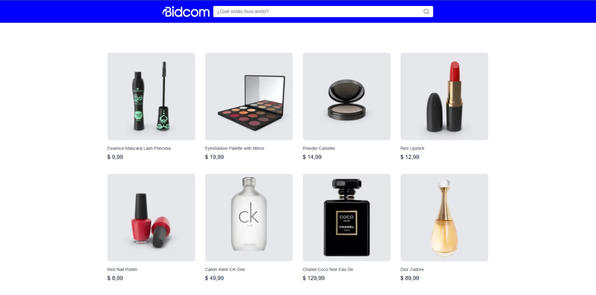
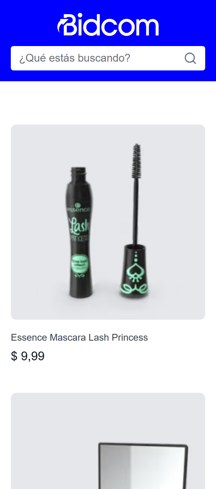
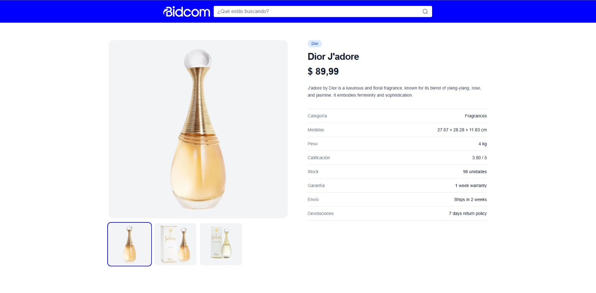
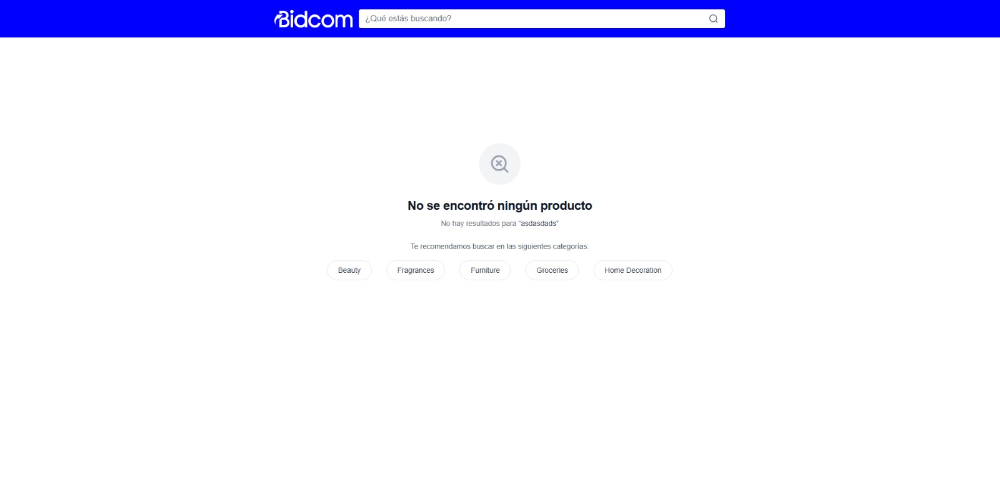
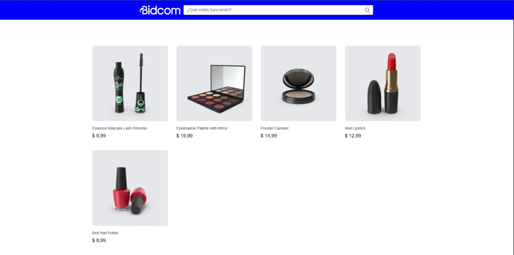

# Ecommerce Bidcom — Evaluación Técnica Frontend

Aplicación de ecommerce desarrollada como parte de la evaluación técnica de Bidcom. Permite buscar productos, ver resultados filtrados por término o categoría, y acceder al detalle de cada producto.

🔗 **Deploy:** [https://ecommerce-bidcom.vercel.app](https://ecommerce-bidcom.vercel.app)

---

## Stack Tecnológico

- **Framework:** Next.js 16 con App Router
- **Lenguaje:** TypeScript
- **Estilos:** Tailwind CSS v4
- **API:** DummyJSON Products API
- **Testing:** Vitest + React Testing Library
- **Deploy:** Vercel

---

## Instalación y Ejecución

```bash
# Instalar dependencias
pnpm install

# Desarrollo
pnpm dev

# Build de producción
pnpm build

# Ejecutar tests
pnpm test
```

---

## Decisiones Técnicas

### Arquitectura: Clean Architecture orientada a módulos

El proyecto sigue los principios de Clean Architecture organizando el código en capas bien definidas:

```
src/
├── app/                  # Presentación — rutas de Next.js (App Router)
├── modules/
│   ├── product/
│   │   ├── domain/       # Entidades e interfaces (Product, ProductRepository)
│   │   ├── application/  # Casos de uso (SearchProducts, FindProductBySku)
│   │   ├── infrastructure/dummyjson/  # Implementación concreta de la API
│   │   └── presentation/ # Componentes React (ProductCard, ProductGrid)
│   └── category/         # Misma estructura para categorías
├── lib/di/               # Contenedor de inyección de dependencias
└── shared/               # Utilidades y componentes compartidos
```

**¿Por qué esta arquitectura?**

- Las páginas (`page.tsx`) no saben que existe DummyJSON. Dependen de interfaces, no de implementaciones concretas → **Dependency Inversion Principle**.
- Cada capa tiene una única razón para cambiar → **Single Responsibility Principle**.
- Si mañana se reemplaza DummyJSON por una API propia, solo cambia la capa `infrastructure/`. El dominio, los casos de uso y la UI no se tocan.

### Manejo del SKU en la URL

El challenge requiere la ruta `/product/$sku`, pero DummyJSON no expone un endpoint de búsqueda por SKU. 

**Problema detectado:** el endpoint de búsqueda `/products/search?q=BEA-ESS-ESS-001` devuelve un array vacío para SKUs exactos.

**Solución:** El SKU de DummyJSON siempre termina con el ID numérico del producto (ej: `BEA-ESS-ESS-001` → ID `1`). Se implementó una utilidad `extractIdFromSku` que parsea el número final del SKU y lo usa para llamar a `/products/{id}`, manteniendo la URL con SKU como exige el challenge.

**Riesgo documentado:** si DummyJSON cambia el formato del SKU, esta función se rompe.

### Búsqueda vs Categorías

El challenge pide que las categorías enlacen a `/search?s=$categoria`. Para diferenciar una búsqueda libre de una búsqueda por categoría (que usa un endpoint distinto de DummyJSON), se agregó un query param adicional `type=category`:

- Búsqueda libre: `/search?s=phone` → endpoint `/products/search?q=phone`
- Búsqueda por categoría: `/search?s=beauty&type=category` → endpoint `/products/category/beauty`

Esto permite usar la misma página de resultados para ambos casos sin duplicar lógica.

### Server Components por defecto

Todas las páginas son Server Components que hacen fetch directo a DummyJSON. Solo `SearchBar` es Client Component porque necesita capturar el input del usuario y leer los query params actuales con `useSearchParams`.

### Formateo de precios

Se usa `Intl.NumberFormat` con locale `es-AR` y moneda `ARS` para formatear precios de forma nativa, sin dependencias externas.

---

## Testing

Se implementaron tests unitarios y de integración para las partes críticas de la aplicación:


| Archivo                    | Tipo        | Qué cubre                                  |
| -------------------------- | ----------- | ------------------------------------------ |
| `formatMoney.test.ts`      | Unitario    | Formateo correcto de precios y casos edge  |
| `extractIdFromSku.test.ts` | Unitario    | Parseo del ID desde el SKU                 |
| `ProductCard.test.tsx`     | Integración | Renderizado de título, precio e imagen     |
| `SearchBar.test.tsx`       | Integración | Renderizado del input, botón y form action |


```bash
pnpm test
# 20 tests, 7 archivos, 0 errores
```

---

## Próximos Pasos

- **Tests E2E** con Playwright para cubrir flujos completos (búsqueda, navegación al detalle, empty state con categorías).
- **Paginación** en el listado de productos.
- **Skeleton loaders** para mejorar la experiencia durante la carga.
- **Internacionalización** de textos estáticos.


## Capturas de Pantalla

### Listado de productos — Desktop


### Listado de productos — Mobile


### Detalle de producto


### Empty state


### Búsqueda por categoría


